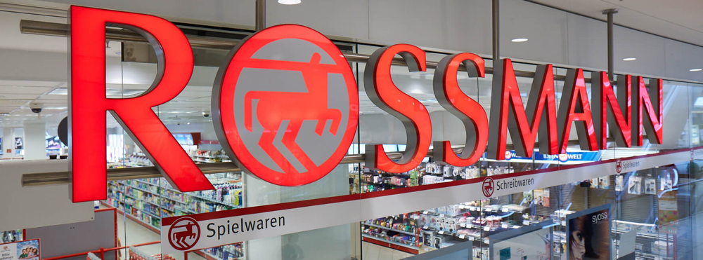

# Rossmann Store Sales Forecast

## The goal of this project is to predict the sales of the next 6 weeks

    

#### This project was made by Alexandre Magno.

# 1. Business Problem.

Rossmann operates over 3,000 drug stores in 7 European countries. Currently, Rossmann store managers are tasked with predicting their daily sales for up to six weeks in advance.

Link dataset: [Rossmann Store Sales | Kaggle](https://www.kaggle.com/c/rossmann-store-sales)

# 2. Business Assumptions.

Store sales are influenced by many factors, including promotions, competition, school and state holidays, seasonality, and locality. With thousands of individual managers predicting sales based on their unique circumstances, the accuracy of results can be quite varied.

# 3. Solution Strategy

My strategy to solve this challenge was:

**Step 01. Data Description:** look for NA values and fill them in, change the type of variables and descriptive statistics

**Step 02. Feature Engineering:** Creation of hypotheses and new features

**Step 03. Data Filtering:** removing unnecessary rows and columns

**Step 04. Exploratory Data Analysis:** Univariate analysis, validation of hypotheses and multivariate analysis

**Step 05. Data Preparation:** rescaling , transformation and encoding 

**Step 06. Feature Selection:** selection of the most important features using Boruta and EDA

**Step 07. Machine Learning Modelling:** Some machine learning models have been trained. The one with the best results after cross-validation proceeds to the next step

**Step 08. Hyperparameter Fine Tunning:** look for hyperparameters to optimize the generalization of the model.

**Step 09. Convert Model Performance to Business Values:** The model performance is converted into business values.

**Step 10. Deploy Model to Production:** The model is implemented in a cloud environment and a bot was created in Telegram to enable other interested parties and services to access its results.

# 4. Top 3 Data Insights

**Hypothesis 01:** Stores with a larger **assortment** should **sell more** on average.

**True.**

**Hypothesis 02:**  Stores should **sell more** over the years

**False.**

**Hypothesis 03:** Store with **closer competitors** should **sell less** 

**False.**

# 5. Machine Learning Model Applied

| **Model Name**          |
| ----------------------- |
| Linear Regression       |
| Lasso                   |
| Random Forest Regressor |
| KNeighbors Regressor    |
| CatBoost Regressor      |

All of them were **cross-validated**

# 6. Machine Learning Model Performance

The random forest model presented a better performance but aiming at **less** computational effort the model chosen was the **CatBoostRegressor**

Before Fine Tuning

    

After Fine Tuning

    

# 7. Deploy model

- The model was deployed on heroku and i create a bot to make a request via API

- Link bot on Telegram: [Sales_Bot](http://t.me/alex_sales_bot)

# 8. Conclusions

The use of machine learning models for sales forecasting is very important for the company because it can make its decisions based on data. And data analysis provides insights that give an overview of the business

# 9. Lessons Learned

- Creation of a bot in Telegram to make a request via API

- The choice of machine learning model used must consider the generalizability of the model, but also the cost of its deployment.

- The exploratory data analysis provides important insights to the business problem, many of which contradict the initial hypothesis. This information is valuable for the understanding of business and for planning future actions. This step also provides a preview of the result of the feature selection step.

# 10. Next Steps to Improve

- I would test neural networks for the problem addressed

- Build a model retraining pipeline 

# 
